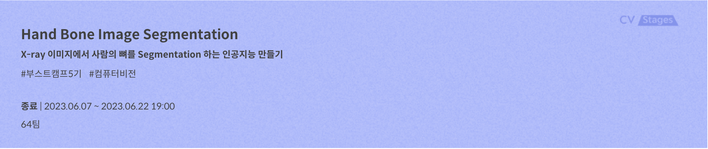
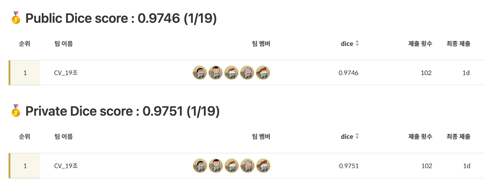
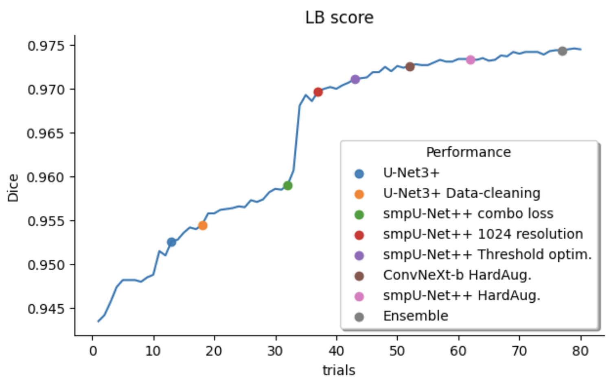

# level2_cv_semanticsegmentation-cv-19
<!-- ALL-CONTRIBUTORS-BADGE:START - Do not remove or modify this section -->
[](#contributors-)
<!-- ALL-CONTRIBUTORS-BADGE:END -->

- [부스트캠프 AI Tech](https://boostcamp.connect.or.kr/program_ai.html) - Level2. Semantic Segmentation Competition  

# Introduction


목표 : 손가락, 손등, 팔에 존재하는 뼈를 29개의 class로 segmentation하는 모델 제작

데이터셋 : 2048 x 2048 크기의 손뼈 X-ray 이미지. (train : 800장, test : 300장)

프로젝트 개발 환경 : Ubuntu 18.04.5 LTS, Intel(R)   Xeon(R) Gold 5120 CPU @ 2.20GHz, Ram 90GB, Tesla V100 32GB

대회 지표 : Dice coefficient

---
## Contributors
**`V.I.P`** **`==`** 
**`✨Visionary Innovative People✨`** 
<table>
  <tr>
    <td align="center"><a href="https://github.com/seoin0110"><br /><sub><b>김서인</b></sub></a><br /><a href="https://github.com/seoin0110" title="Code"></td>
    <td align="center"><a href="https://github.com/moons98"><br /><sub><b>문상인</b></sub></a><br /><a href="https://github.com/moons98" title="Code"></td>
    <td align="center"><a href="https://github.com/jaehun-park"><br /><sub><b>박재훈</b></sub></a><br /><a href="https://github.com/jaehun-park" title="Code"></td>
    <td align="center"><a href="https://github.com/adam1206"><br /><sub><b>이강민</b></sub></a><br /><a href="https://github.com/adam1206" title="Code"></td>
     <td align="center"><a href="https://github.com/Jeon-jisu"><br /><sub><b>전지수</b></sub></a><br /><a href="https://github.com/Jeon-jisu" title="Code"></td>
  </tr>
</table>

###  역할
|팀원|역할|
|-----|---|
|김서인| train data 시각화 EDA, U-Net 및 smp 모델 베이스라인 구축, hard voting ensemble 및 debug mode 구현|
|문상인| Baseline 구축, EDA, Loss fn 구현, Segformer/Mask2former 실험 |
|박재훈| hugging-face 모델 코드 구축, Ensemble 구현, 마스킹 임계값 최적화, 모델 추론 시각화|
|이강민| DeepLab 베이스라인 구축 및 실험 진행, U-Net 실험|
|전지수| PM, mmseg 베이스라인 구축 및 실험 시도, Convnext  실험|

## Tech Skill

       


---

## Repository 구조
- Repository 는 다음과 같은 구조로 구성되어 있습니다. 

```
├── .github
├── datasets
├── codebook
├── images
├── losses
├── model
├── trainer
├── utils
├── .gitignore
└── README.md
```

----
# **실행 방법**
#### **install requirements**

`pip install -r requirements.txt`
#### **train**

``./configs/queue`` 폴더에 base_config.json와 같은 형식의 config 파일 작성

`python train.py --config ./configs/queue/base_config.json`

여러개의 config를 자동 학습하고자 할 때, `./configs/queue` 폴더에 여러 개의 conifg.json을 넣은 후

`sh auto_trainer.sh`

#### **inference**

`python inference.py --exp {exp_folder} --img_size 1024 --save_logits`

<br>

----
## 실험 내용
|분류|내용|
  |-----|---|
  |Dataset|**EDA** <br>- 특정 손목뼈는 다른 뼈와 많은 부분 겹쳐서 존재<br>- 손의 각도가 다른 데이터 샘플 (train: 약 11%, val: 약 58%)<br>- 네일아트, 반지 및 철심 등 특이 데이터 존재<br><br>  **Dataset 구성**<br>- 특이 데이터 삭제<br>- 양 손을 한 그룹으로 묶는 GroupKFold<br>- 각도 분포 보정을 위한 Stratified K-fold|
  |Models| **CNN 및 Transformer 모델을 골고루 섞어 학습**<br>- CNN: U-Net, U-Net++, DeepLab, ConvNeXt<br>- Transformer: Mask2Forner, SegFormer |
  |Data augmentation| **Hard Augmentation 적용**<br>- Resize<br>- RandomBrightnessContrast<br>- ElasticTransform<br>- ImageCompression<br>- OneOf([Blur, MedianBlur])<br>- HorizontalFlip<br>- CLAHE|
  |Optimizer|- AdamW 고정, lr에 민감해서 ReduceLROnPlateau와 CosineAnnealingWarmupRestarts scheduler를 가지고 모델 별 세팅값 조절|
  |Loss| - Focal Loss와 Dice Loss를 weighted sum한 Combo Loss 사용|
  |Ensemble|- Class 별 다른 threshold를 가져가는 class-wise threshold 적용<br>- Hard-Voting |
  |MixedPR|- 1024의 해상도 학습을 위해 fp16 연산을 수행 |

----
## 협업 툴 및 프로젝트 관리

### 1. GitHub
- GitFlow를 따라 Github를 활용했다. 개발 과정에서 다음과 같은 절차를 따라 진행했다.
  - 이슈 생성
  - Feature branch 생성
  - Pull Request
  - 코드 리뷰 및 merge
- commit message는 ‘feat: ~ ’ 형식을 사용하였고, issue와 관련된 commit인 경우 issue 번호를 commit message의 foot에 추가해주었다.

### 2. Notion

### 3. WandB
- validation Dice, train/val loss learning rate 등 실험 결과와 config.json setting 값들을 로깅하였다.

----

## 프로젝트 결과
**`최종 순위 1등/19팀`**<br><br>



  